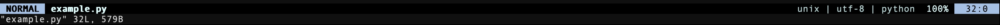

# Favorite Vim 💚


## Owerview

[Vim](https://www.vim.org) is a powerful text editor with complete freedom of customization and automation made possible by extensions and add-ons.\
I like vim, it allows you to work anywhere right from the terminal. And it doesn’t matter what you have: a Linux virtual server without a visual or a personal computer, you can always write vim on the command line and start your work!\
This repository contains a small vim configuration tweak to make working with Python easier. Comments are attached to the file.

## Instalation
I made convenient bash scripts that need to be run from the repository directory with one command ( `source ./autotune/.bash-<YOUR OS>` ) and everything will be ready\
But for those who love transparency, follow the step by step:

1. First install vim.

    **For MacOS**\
    _(how to install [brew](https://brew.sh) package manager for mac)_
    ```bash
    brew install vim
    ```

    **For Linux**
    ```bash
    sudo apt install vim -y
    ```

2. Next, install the vim plugin manager: [Vundle](https://github.com/VundleVim/Vundle.vim#quick-start)\
    _(already most of the work is done, you just need to copy this command to the terminal use git clone)_
    ```bash
    git clone https://github.com/VundleVim/Vundle.vim.git ~/.vim/bundle/Vundle.vim
    ```

3. After copy the .vimrc file to the directory with the user and theme configuration.\
   _(this is how we show _vim_ our settings)_
    ```bash
    mkdir -p ~/.vim/autoload/airline/
    cp -R colors/ ~/.vim/colors/
    cp -R airline/ ~/.vim/autoload/airline/
    cp .vimrc ~/.vimrc
    ```

1. Install all required plugins
    ```bash
    vim +PluginInstall +qall
    ```

🎉 All is ready! Now, when you run the `vim` command, it will open with the configuration installed. Enjoy 😄

## Example

Let's see vim in action, just use this command
```bash
vim example.py
```

## Screenshots



